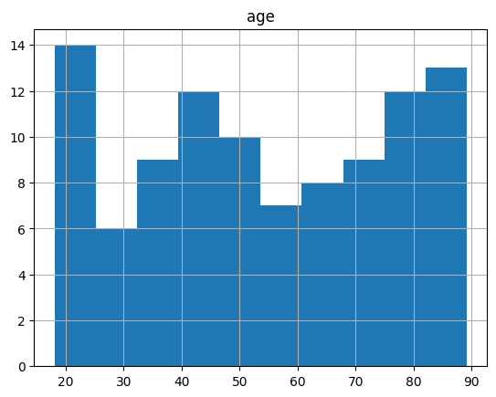

## `Programování` 1 pro matematiky

# 13. cvičení, 010-01-2024

-----

**Obsah**:

0. Farní oznamy
1. Úvod: numpy, pandas, matplotlib
2. Numpy
3. Pandas

### Farní oznamy

1. **Materiály k přednáškám** najdete v GitHub repozitáři https://github.com/PKvasnick/Programovani-1. Najdete tam také kód ke cvičením a pdf soubory textů cvičením.
2. **Domácí úkoly** - pokud vám chybí body k zápočtu, dobrý čas s tím něco dělat je **teď.** 
3. **Kde se nacházíme** Končíme. 
4. **Poznámka ke dnešnímu cvičení** Pro demonstraci používáme Jupyter notebook. Google Colab notebook vám poslouží stejně dobře. Hlavní důvod jsou grafy, vše ostatní vám poběží i v textovém prostředí. 

---

## Úvod

Dnes se seznámíme se třemi Pythonskými balíčky, které tvoří zákklad ekosystému pro technické počítání v Pythonu:

- **numpy** je základní modul, který je “dependencí” pro ostatní moduly. Podporuje vícerozměrná pole, algebru nad nimi, lineární algebru, speciální funkce, optimalizaci, náhodné generátory, podporu hardwaru ‚(GPU) a ještě mnoho jiných věcí. 

Dolumentace: www.numpy.org


Numpy zabezpečuje také integraci C/C++ a Fortranského kódu s Pythonem.


Úzce navázaný na modul numpy je modul **SciPy**.  Obsahuje řadu základních algoritmů, rozšiřujících (nebo duplikujících) `numpy` .


---

- **Pandas** je modul, definující datové tabulky a operace s nimi. Datové tabulky jsou specifické datové objekty pro zpracování dat a blíž než k maticím mají k Excelovským listům

pandas.pydata.org


---

- **matplotlib** je základní knihovna pro vytváření grafů. Má API pro různé jazyky, ale nejširší použití má právě v Pythonu. Podporuje širokou škálu vyjádřovacích možností, typú grafů atd. Je také základnou pro další grafické knihovny.

matplotlib.org


Tento modul nemá vyhrazenou speciální část v následujícím výkladu - je to tím, že ho budeme používat pro grafické znázornění výsledků pro ostatní dva  moduly. 


**Instalace**

Základní možnost je instalovat moduly pomocí pip (`pip install numpy pandas matplotlib`). Instalace chvíli trvá, moduly jsou veliké a mají další závislosti. 

Lepší je proto instalovat nějakou distribuci, která obsahuje tyto moduly a jejich dependence, například `anaconda`.

---


## numpy

```python
import numpy as np
```

Toto je standardní způsob importu modulu *numpy* a i když není povinný, je rozumné ho používat. Stejně tak máme standardní způsoby importu dalších modulů:

```python
import pandas as pd
import matplotlib.pyplot as plt
```

### numpy array

*numpy* podporuje vícerozměrná pole a operace s nimi. 

numpy array lze vytvořit více způsoby:

```python
# Vytváříme numpy pole:

# 1. Konverzí seznamu a úpravou tvaru
a = np.arange(12).reshape(3,4)
print("a", a)

a [[ 0  1  2  3]
 [ 4  5  6  7]
 [ 8  9 10 11]]

# 2. Zadáním dimenze: prázdné pole
b = np.ndarray((3,4))
print("b", b)

b [[0.0e+000 4.9e-324 9.9e-324 1.5e-323]
 [2.0e-323 2.5e-323 3.0e-323 3.5e-323]
 [4.0e-323 4.4e-323 4.9e-323 5.4e-323]]

# 3. Specializovaným konstruktorem
c = np.zeros((3,4))
print("c",c)

c [[0. 0. 0. 0.]
 [0. 0. 0. 0.]
 [0. 0. 0. 0.]]

d = np.ones((3,4))
print("d", d)
d [[1. 1. 1. 1.]
 [1. 1. 1. 1.]
 [1. 1. 1. 1.]]
```

**Vytváření sekvencí**:

`np.arange` - jako range, ale vytváří np.array

`np.linspace` - pravidelné číselné řady:

```
print(np.linspace(0, 10, 20, endpoint = True))
print(np.linspace(0, 10, 20, endpoint = False))
---
[ 0.          0.52631579  1.05263158  1.57894737  2.10526316  2.63157895
  3.15789474  3.68421053  4.21052632  4.73684211  5.26315789  5.78947368
  6.31578947  6.84210526  7.36842105  7.89473684  8.42105263  8.94736842
  9.47368421 10.        ]
[0.  0.5 1.  1.5 2.  2.5 3.  3.5 4.  4.5 5.  5.5 6.  6.5 7.  7.5 8.  8.5
 9.  9.5]
```

**Kreslíme**

```python
import matplotlib.pyplot as plt
x = np.linspace(-3,3, 100, endpoint = True)
plt.plot(np.cos(2*x), np.sin(3*x))
```


`np.sin, np.cos` jsou vektorizované verze `math.sin, math.cos` a numpy má takovýchto vektorizovaných verzí od běžných funkcí mnoho a umožňuje vytvářet vlastní.

### operace s poli

```python
print(a)
arev = np.arange(11,-1,-1).reshape(3,4)
print(arev)

print(a+arev)
print(a*arev)
print(a / arev)
---
[[ 0  1  2  3]
 [ 4  5  6  7]
 [ 8  9 10 11]]
[[11 10  9  8]
 [ 7  6  5  4]
 [ 3  2  1  0]]
[[11 11 11 11]
 [11 11 11 11]
 [11 11 11 11]]
[[ 0 10 18 24]
 [28 30 30 28]
 [24 18 10  0]]
[[ 0.          0.1         0.22222222  0.375     ]
 [ 0.57142857  0.83333333  1.2         1.75      ]
 [ 2.66666667  4.5        10.                 inf]]

<ipython-input-20-1a385f80933a>:7: RuntimeWarning: divide by zero encountered in divide
  print(a / arev)

```

Všechny operace jsou mezi odpovídajícími prvky polí, tedy ne matickvé operace. Ty si musíme explicitně vyžádat. 

Co když nesouhlasí rozměry?

```
v = np.arange(1,4).reshape(3,1)
print(v)
print(a*v)
print(v*a)
---
[[1]
 [2]
 [3]]
[[ 0  1  2  3]
 [ 8 10 12 14]
 [24 27 30 33]]
[[ 0  1  2  3]
 [ 8 10 12 14]
 [24 27 30 33]]
```

Chybějící data se inteligentně doplní (pravidla jsou velice komplexní)  - *broadcasting*

---

Iterace přes pole:

```python
for i in a:
  print(i)

for i in np.nditer(a):
  print(i)
---
[0 1 2 3]
[4 5 6 7]
[ 8  9 10 11]
0
1
2
3
4
5
6
7
8
9
10
11
```


### Náhodné generátory v numpy

```python
# Náhodný generátor
rng = np.random.default_rng()
print(rng.random(10))
plt.hist(rng.random(10000), bins=21)
---
[0.11413139 0.91544601 0.31044065 0.96895694 0.64600164 0.08063942
 0.65753678 0.94372576 0.96397951 0.88515821]

(array([479., 471., 431., 458., 470., 485., 489., 453., 499., 494., 502.,
        493., 474., 472., 478., 478., 485., 484., 465., 475., 465.]),
 array([3.97768540e-05, 4.76501326e-02, 9.52604884e-02, 1.42870844e-01,
        1.90481200e-01, 2.38091556e-01, 2.85701912e-01, 3.33312267e-01,
        3.80922623e-01, 4.28532979e-01, 4.76143335e-01, 5.23753691e-01,
        5.71364046e-01, 6.18974402e-01, 6.66584758e-01, 7.14195114e-01,
        7.61805469e-01, 8.09415825e-01, 8.57026181e-01, 9.04636537e-01,
        9.52246893e-01, 9.99857248e-01]),
 <BarContainer object of 21 artists>)
```


```python
plt.hist(rng.standard_normal(2000), bins=np.linspace(-3,3,11,endpoint=True))
---
(array([ 18.,  47., 168., 309., 453., 441., 329., 162.,  57.,   9.]),
 array([-3. , -2.4, -1.8, -1.2, -0.6,  0. ,  0.6,  1.2,  1.8,  2.4,  3. ]),
 <BarContainer object of 10 artists>)
```


### Lineární algebra

```python
a = np.arange(10).reshape(5,2)
print(a)
b = np.arange(6).reshape(2,3)
print(b)
print(np.matmul(a, b))
---
[[0 1]
 [2 3]
 [4 5]
 [6 7]
 [8 9]]

[[0 1 2]
 [3 4 5]]

[[ 3  4  5]
 [ 9 14 19]
 [15 24 33]
 [21 34 47]
 [27 44 61]]
```

```python
c = np.array([1,1,0,0,-1,1,0,0,1]).reshape(3,3)
print(c)
print(np.linalg.inv(c))
print(np.matmul(c, np.linalg.inv(c)))
---
[[ 1  1  0]
 [ 0 -1  1]
 [ 0  0  1]]
[[ 1.  1. -1.]
 [-0. -1.  1.]
 [ 0.  0.  1.]]
[[1. 0. 0.]
 [0. 1. 0.]
 [0. 0. 1.]]
```

```python
np.linalg.eig(c)
---
(array([ 1., -1.,  1.]),
 array([[ 1.00000000e+00, -4.47213595e-01, -1.00000000e+00],
        [ 0.00000000e+00,  8.94427191e-01,  2.22044605e-16],
        [ 0.00000000e+00,  0.00000000e+00,  4.44089210e-16]]))
```

```python
print(c)
print(np.linalg.svd(c))
---
[[ 1  1  0]
 [ 0 -1  1]
 [ 0  0  1]]
(array([[ 0.59100905, -0.73697623,  0.32798528],
       [-0.73697623, -0.32798528,  0.59100905],
       [-0.32798528, -0.59100905, -0.73697623]]), 
 array([1.80193774, 1.2469796 , 0.44504187]), 
 array([[ 0.32798528,  0.73697623, -0.59100905],
       [-0.59100905, -0.32798528, -0.73697623],
       [ 0.73697623, -0.59100905, -0.32798528]]))
```


## pandas

Modul `pandas` podporuje datové tabulky (*DataFrame*) a operace nad nimi.

1. Přístup

Datové tabulky jsou myšleny jako read-only, tedy se nepředpokládá, že budete chtít měnit hodnoty položek. Můžete ale různě přeskupovat data a přidávat nové sloupce či souhrny. Základní mód zpracování:
$$
\textrm{group} \rightarrow \textrm{apply} \rightarrow \textrm{combine}
$$

2. Struktura

Datové tabulky jsou uchovávány po sloupcích. Proto přidání sloupce je jednoduché, ale přidání řádku je velice časově náročné. 


```python
import pandas as pd

data = pd.DataFrame({
    "sex": np.random.choice(["M","F"], 100),
    "age": np.random.uniform(low = 18, high=90, size = 100),
}, index = np.arange(100)
)
print(data)
data.hist("age")
---
   sex        age
0    M  67.273757
1    M  30.689785
2    M  52.553379
3    M  89.154159
4    F  47.129377
..  ..        ...
95   M  56.412083
96   M  73.289160
97   M  28.874982
98   M  66.894197
99   M  58.513988

[100 rows x 2 columns]

array([[<Axes: title={'center': 'age'}>]], dtype=object)
```



```
data.pivot_table(values="age", index="sex", aggfunc = {np.mean, np.std})
```


