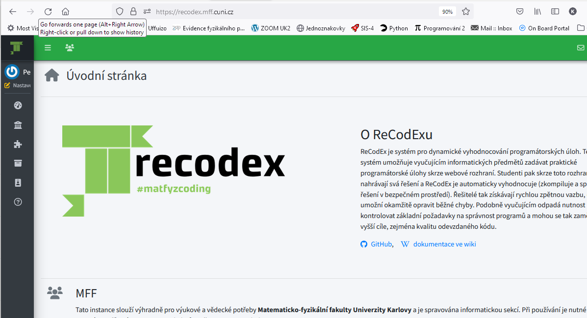
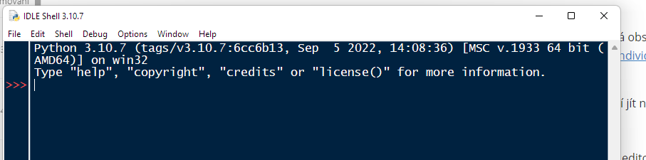

## Programování 1 pro matematiky

# 1. cvičení, 04-10-2023

**Obsah**:

- co budeme dělat v tomto semestru
- co od sebe očekáváme a pravidla hry
- první kroky v Pythonu

## Co budeme dělat

**NMN111 Programování I, dotace 0/2, zakončení zápočtem**

> Náplní předmětu Programování 1 jsou základy programovacího jazyka Python, ovládnutí jeho příkazů a  také praktické práce u počítače při psaní a ladění programů. Jde nám  tedy pouze o technickou stránku věci, nebudeme se příliš věnovat  nějakému výkladu algoritmů a už vůbec ne jejich efektivitě, tomu bude  věnován až předmět Programování 2 v letním semestru.


V minulých letech jsme během zimního semestru učivo procházeli zhruba následovně:

1. Úvod, podmínky k zápočtu, ReCodEx. Instalace Pythonu, IDLE. Python jako  kalkulačka. Výrazy, operace s čísly, relace, logické spojky. Programy -  základní input a print, while, if, indentace, komentáře.

2. Pořádně print, if (zanořování, elif), ciferný součet, Euklidův algoritmus, test prvočíselnosti.

3. Zpracování posloupnosti dat. Seznamy, operace, indexování.

4. Seznamy - operace. Více čísel na řádku - split(). Fibonacciho čísla, vyhledávání v poli, třídění.

5. Formátovaný výstup. Ladění programu. Funkce - parametry, lokalita.

6. Řezy seznamů a řetězce.

7. N-tice (tuples). List comprehension. Gaussova eliminace.

8. Množiny a slovníky.

9. Základy objektového programování.

10. Objektový návrh programu.

11. Funkce jako objekt. Lambda-funkce.

12. Soubory. Výjimky.

13. Standardní knihovna (random, itertools, …)

Tento přehled je jen rámcový,  k jednotlivým tématům se budeme opakovaně vracet v kruzích.

**Pomoc**

Budeme dělat jednoduché věci, ale programování je spojeno s častými pocity frustrace, když vám nebude fungovat něco, co by podle vás určitě fungovat mělo. Základní postup v takovémto případě je zeptat se lámanou angličtinou Googlu. Zpravidla najdete kvalifikovanou odpověď. 

Klidně se ptejte i mě, v průběhu cvičení, nebo e-mailem. Nepodceňujte zejména problémy s instalací nebo během Pythonu na svém počítači, ty je potřeba vyřešit bezodkladně.

**GPT, GitHub Copilot a další AI**

Očekává se, že se naučíte programovat vlastní hlavou, především že sa naučíte algoritmizovat úlohy a naučíte se základním algoritmům. Proto v některých situacích nebudete smět používat AI jako pomůcku. V ostatních neváhejte a zkoušejte. 

### Podmínky zápočtu: domácí úkoly

Budete dostávat domácí úkoly a odevzdávat je přes **ReCodEx**, https://recodex.mff.cuni.cz. 




**Zaregistrujte se v ReCodExu**. Použijte svoje přístupové údaje do SISu. Pak se prosím zaregistrujte do skupiny pro toto cvičení,  můžete tak učinit volbou "SIS integration".  Tento krok je nutný, abyste si v ReCodExu nasli své domácí úkoly a mohli je i odevzdávat. 

Pro zápočet budu požadovat **50% správných odevzdaných domácích úkolů**. Hodnocení bude tolerantní: váš kód nemusí být uplně správný, pokud bude jasně vykazovat autenticky vynaložené úsilí a adekvátní zvládnutí probraných témat.  

Zpravidla dostanete na každém cvičení 3 úlohy. Z hlediska bodú jsou všechny tři úlohy ekvivalentní. 

#### Kdo jsou účastníci zájezdu a co z toho vyplývá

Někteří z vás už umi programovat v Pythonu a někteří jste úplní začátečníci. 

Na tomto cvičení bychom měli poněkud srovnat hendikepy. Proto bude platit několik nespravedlivých pravidel:

- Pokud máte pocit, že Python umíte a jenom byste se tady nudili, nemusíte cvičení navštěvovat. Musíte ale nasbírat dostatečný počet bodů za domácí úkoly.
- Domácí ukoly jsou většinou hodnoceny 10 body bez ohledu na obtížnost.  Bonusové úlohy bývají náročnější, aby si pokročilejší Pythonisté mohli vyzkoušet svaly. 

---

### Instalace Pythonu

Tady máme vícero možností a nechám na váš výběr, kterou si zvolíte. 

1. **Základní distribuce Pythonu**

   Stáhněte si instalátor pro svůj systém tady: https://www.python.org/downloads/.

   Zvolte si nejnovější verzi 3.11. Součástí je vlastní interpret a jednoduché IDE _Idle_. S tímto klidně vystačíte pro celý kurz, ale pro následující semestr už budete chtít pracovat v nějakém vyspělejším prostředí.

2. **Anaconda**

   Toto je velká distribuce, která obsahuje rozsáhlou podporu pro využítí Pythonu ke zpracování dat, strojové učení a pod. Stáhnete si ji tady: https://www.anaconda.com/products/individual a zabere vám docela hodně místa na disku. Součástí je i vyspělé IDE pro vývoj v Pythonu - _Spyder_. 

3. **Google Colab notebooky**

   Nemusíte nic instalovat, stačí jít na colab.google.com a začít psát kód do notebooku.
   
   https://colab.research.google.com
   
   Potřebujete ale Google účet. 

4.  **JupyterLab aplikace **

   Tuto aplikaci můžete provozovat s vlastním serverem notebooku, takže nepotřebujete externí server. 

   [](https://github.com/jupyterlab/jupyterlab-desktop)

---

**IDE pro Python**

Existuje několik programovacích editorú a vývojových prostředí pro Python, například _PyCharm_,  VSCode, _Spyder_, _Sublime Text_, atd. Klidně si na ně přejděte, když vám spartánské _Idle_ přestane vyhovovat. U Windows je jednodušší pro tyto IDE použít distribuci Anaconda.

### První kroky v Pythonu

Konečně se dostáváme k vlastnímu programování. Otevřeme si Idle konzoli:



#### Práce s konzolí - Python jako kalkulačka

```{python}
>>> 1+1
2
>>> 2+3*4+5
19
>>> 2 + 3*4 + 5
19
>>> (2+3)*(4+5)
45
>>> 2**10
1024
>>> 2**100
1267650600228229401496703205376
```

####  Desetinná čísla

```{python}
>>> 1/3
0.3333333333333333
>>> 1/3 * 3
1.0
>>> 1/6 + 1/6 + 1/6 + 1/6 + 1/6 + 1/6
0.9999999999999999
>>> 1 / (2**100)
7.888609052210118e-31
```

#### Celočíselné dělení a modulo

```{python}
>>> 7 // 3
2
>>> 7 % 3
1
>>> -7 // 3
-3
>>> -(7//3)
-2
>>> (7 // 3) * 3 + 7 % 3
7
```

#### Proměnné

```{python}
>>> a = 100
>>> b = 23
>>> a+b
123

>>> soucet = 0
>>> soucet = soucet + 10
>>> soucet = soucet + 3
>>> soucet
13
>>> soucet += 1
>>> soucet
14
```

#### Matematické funkce

```{python}
>>> import math
>>> math.pi
3.141592653589793
>>> math.sin(math.pi / 3)
0.8660254037844386
```

*math* je modul. Modul je něco jako adresář plný Pythonského kódu, který si přitáhnete do svého programu, a získáte tak přístup k funkcím a třídám modulu. 

#### Nápověda

```{python}
>>> help(math.sin)
>>> help(math)
```

#### Logické výrazy

```{python}
>>> 5**7 > 7**5
True
>>> math.cos(0) < 0
False
>>> 0.8 <= sin(pi/3) <= 0.9
True
>>> pi>3 and pi<4
True
>>> x>0 or not x>0
True
>>> 1 == 1
True
>>> 1 != 2
True
```

#### Seznamy, množiny, slovníky

```python
>>> seznam = [1, 2, 3]
>>> seznam[0]
1
>>> seznam[1]
2
>>> seznam.append(4)
>>> seznam
[1, 2, 3, 4]
>>> seznam.pop()
4
>>> seznam
[1, 2, 3]
```

```python
>>> ovoce = {"jablka", "hrušky", "pomeranče"}
>>> ovoce.add("švestky")
>>> ovoce
{"jablka", "hrušky", "švestky", "pomeranče"}
>>> ovoce.add("hrušky")
>>> ovoce
{"jablka", "hrušky", "švestky", "pomeranče"}
```

```python
>>> číslice = {"jedna" : 1, "dva" : 2, "tři" : 3}
>>> číslice["tři"]
3
>>> číslice["čtyři"] = 4
>>> číslice
{"jedna" : 1, "dva" : 2, "tři" : 3, "čtyři" : 4}
```

#### Náš první program: počítáme od 1 do 10

```{python}
i = 1
while i <= 10:
   print(i)
   i += 1
```

Odsazení je v Pythonu nekompromisně vyžadováno a musí být konzistentní. Tedy pokaždé pro stejnou úroveň stejné odsazení. Nahrazuje závorky kolem programových struktur.

```{python}
i = 1
while i <= 10:
   if i%2 == 0:
      print(i)
   i += 1
```

Teď se ještě zeptáme, do kolika se má počítat:

```{python}
n = int(input("Do kolika chceš počítat? "))
i = 1
while i <= n:
   if i%2 == 0:
      print(i)
   i += 1
```
Nakonec můžeme přidat do textu komentáře: Python ignoruje znaky za `#` až do konce řádku.
Komentář s vykřičníkem v prvním řádku, `#!/usr/bin/env python3`, se nazývá _shebang_ a v unixových systémech informuje, jak se má soubor spustit. 

```{python}
#!/usr/bin/env python3

# Nejprve zjistíme, do kolika počítat
n = int(input("Do kolika chceš počítat? "))

# Aktuální číslo
i = 1
while i <= n: 			# Ještě pokračovat?
   if i%2 == 0: 		# Je číslo sudé?
      print(i)
   i += 1 				# Další, prosím!
```

Radši nepoužívejte v zdrojovém kódu a v komentářích diakritiku, pokud to není nevyhnutné. Můžete občas narazit na nepříjemné problémy. 