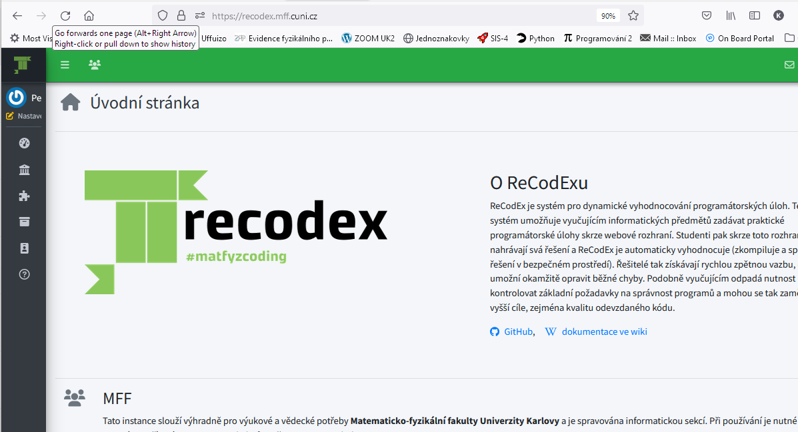
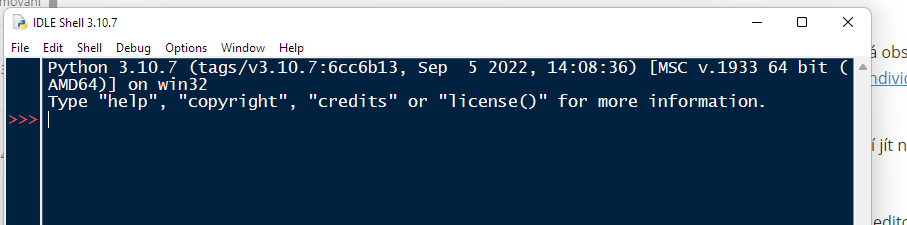

## Programování 1 pro matematiky

# 1. cvičení, 30-09-2025

**Obsah**:

- co budeme dělat v tomto semestru
- co od sebe očekáváme a pravidla hry
- první kroky v Pythonu


## Co budeme dělat

**NMN111 Programování I, dotace 0/2, zakončení zápočtem**

> Náplní předmětu Programování 1 jsou základy programovacího jazyka Python, ovládnutí jeho příkazů a  také praktické práce u počítače při psaní a ladění programů. Jde nám  tedy pouze o technickou stránku věci, nebudeme se příliš věnovat  nějakému výkladu algoritmů a už vůbec ne jejich efektivitě, tomu bude  věnován až předmět Programování 2 v letním semestru.


V minulých letech jsme během zimního semestru učivo procházeli zhruba následovně:

1. Úvod, podmínky k zápočtu, ReCodEx. Instalace Pythonu, IDLE. Python jako  kalkulačka. Výrazy, operace s čísly, relace, logické spojky. Programy -  základní input a print, while, if, indentace, komentáře.

2. Pořádně print, if (zanořování, elif), ciferný součet, Euklidův algoritmus, test prvočíselnosti.

3. Zpracování posloupnosti dat. Seznamy, operace, indexování.

4. Seznamy - operace. Více čísel na řádku - split(). Fibonacciho čísla, vyhledávání v poli, třídění.

5. Formátovaný výstup. Ladění programu. Funkce - parametry, lokalita.

6. Řezy seznamů a řetězce.

7. N-tice (tuples). List comprehension. Gaussova eliminace.

8. Množiny a slovníky.

9. Základy objektového programování.

10. Objektový návrh programu.

11. Funkce jako objekt. Lambda-funkce.

12. Soubory. Výjimky.

13. Standardní knihovna (random, itertools, …)

Tento přehled je jen rámcový,  k jednotlivým tématům se budeme opakovaně vracet v kruzích.

**Pomoc**

Budeme dělat jednoduché věci, ale programování je spojeno s častými pocity frustrace, když vám nebude fungovat něco, co by podle vás určitě fungovat mělo. Základní postup v takovémto případě je zeptat se lámanou angličtinou Googlu. Zpravidla najdete kvalifikovanou odpověď.  Většina dotazů vás zavede na portál StackOverflow, kde často najdete kvalifikované odpovědi na otázky, které už před vámi položil někdo jiný. 

Na internetu najdete také specializované výukové materiály pro Python. Doporučuji zejména portály GeeksForGeeks anebo RealPython.

Klidně se ptejte i mě, v průběhu cvičení, nebo e-mailem. Nepodceňujte zejména problémy s instalací nebo během Pythonu na svém počítači, ty je potřeba vyřešit bezodkladně.


**GPT, GitHub Copilot a další AI**

Očekává se, že se naučíte programovat vlastní hlavou, především že sa naučíte algoritmizovat úlohy a naučíte se základním algoritmům. Proto v některých situacích nebudete smět používat AI jako pomůcku. V ostatních neváhejte a zkoušejte. 


### Podmínky zápočtu: domácí úkoly

Budete dostávat domácí úkoly a odevzdávat je přes **ReCodEx**, https://recodex.mff.cuni.cz. 




**Zaregistrujte se v ReCodExu (hned teď**. Použijte svoje přístupové údaje do SISu. Pak se prosím zaregistrujte do skupiny pro toto cvičení,  můžete tak učinit volbou *_SIS integration_*.  Tento krok je nutný, abyste si v ReCodExu našli své domácí úkoly a mohli je i odevzdávat. 

Pro zápočet budu požadovat **60% správných odevzdaných domácích úkolů**. Hodnocení bude tolerantní: váš kód nemusí být uplně správný, pokud bude jasně vykazovat autenticky vynaložené úsilí a adekvátní zvládnutí probraných témat.  

Zpravidla dostanete na každém cvičení 2 úlohy. Z hlediska bodú jsou obě úlohy ekvivalentní. 

Je možné , že v průběhu semestru otevřu další ReCodExovou skupinu pro příklady ze cvičení.

#### Jak pracuje ReCodEx?

Úlohy v ReCodExu obsahují kromě zadání také soubor testovacích dat, tedy několik dvojic souborů, z nichž jeden obsahuje data pro vstup a druhý požadovaný výsledek. ReCodEx váš kód opakovaně spouští se vstupními daty a výsledek porovnává s požadovaným výstupem. 

> [!WARNING]
>
> ReCodEx není nadán umělou inteligencí a k porovnávání přistupuje naprosto striktně. Nikdy tedy nevypisujte na výstup nic jiného než se požaduje. 


#### Kdo jsou účastníci zájezdu a co z toho vyplývá

Někteří z vás už umi programovat v Pythonu a někteří jste úplní začátečníci. 

Na tomto cvičení bychom měli poněkud srovnat hendikepy. Proto bude platit několik nespravedlivých pravidel:

- Pokud máte pocit, že Python umíte a jenom byste se tady nudili, nemusíte cvičení navštěvovat. Stačí, když nasbíráte dostatečný počet bodů za domácí úkoly.
- Domácí úkoly jsou většinou hodnoceny 10 body bez ohledu na obtížnost.  
- Za hezká řešení přidávám dodatečné body. 

---

### Instalace Pythonu

Tady máme vícero možností a nechám na váš výběr, kterou si zvolíte. 

1. **Základní distribuce Pythonu**

   Stáhněte si instalátor pro svůj systém tady: https://www.python.org/downloads/.

   Zvolte si nejnovější verzi 3.13.7. Součástí instalace je vlastní interpret a jednoduché IDE _Idle_. S tímto klidně vystačíte pro celý kurz, ale pro následující semestr už budete chtít pracovat v nějakém vyspělejším prostředí.

2. **Anaconda**

   Toto je velká distribuce, která obsahuje rozsáhlou podporu pro využítí Pythonu ke zpracování dat, strojové učení a pod. Stáhnete si ji tady: https://www.anaconda.com/products/individual a zabere vám docela hodně místa na disku. Součástí je i vyspělé IDE pro vývoj v Pythonu - _Spyder_. 

3. **Google Colab notebooky**

   Nemusíte nic instalovat, stačí jít na colab.google.com a začít psát kód do notebooku.
   
   https://colab.research.google.com
   
   Potřebujete ale Google účet. 

4.  **JupyterLab aplikace **

   Tuto aplikaci můžete provozovat s vlastním serverem notebooku, takže nepotřebujete externí server. 

   [](https://github.com/jupyterlab/jupyterlab-desktop)

---

**IDE pro Python**

Existuje několik programovacích editorú a vývojových prostředí pro Python, například _PyCharm_,  VSCode, _Spyder_, atd. Klidně si na ně přejděte, když vám spartánské _Idle_ přestane vyhovovat. U Windows je jednodušší pro tyto IDE použít distribuci Anaconda.

### První kroky v Pythonu

Konečně se dostáváme k vlastnímu programování. Otevřeme si Idle konzoli:



#### Práce s konzolí - Python jako kalkulačka

```{python}
>>> 1+1
2
>>> 2+3*4+5
19
>>> 2 + 3*4 + 5
19
>>> (2+3)*(4+5)
45
>>> 2**10
1024
>>> 2**100
1267650600228229401496703205376
```

####  Desetinná čísla

```{python}
>>> 1/3
0.3333333333333333
>>> 1/3 * 3
1.0
>>> 1/6 + 1/6 + 1/6 + 1/6 + 1/6 + 1/6
0.9999999999999999
>>> 1 / (2**100)
7.888609052210118e-31
```

#### Celočíselné dělení a modulo

```{python}
>>> 7 // 3
2
>>> 7 % 3
1
>>> -7 // 3
-3
>>> -(7//3)
-2
>>> (7 // 3) * 3 + 7 % 3
7
```

#### Proměnné

```{python}
>>> a = 100
>>> type(a)
<class 'int'>
>>> b = 23
>>> a+b
123

>>> soucet = 0
>>> soucet = soucet + 10.0
>>> type(soucet)
<class 'float'>
>>> soucet += 3
>>> soucet
13.0
>>> int(soucet)
13
```

#### Matematické funkce

```{python}
>>> import math
>>> math.pi
3.141592653589793
>>> math.sin(math.pi / 3)
0.8660254037844386
```

*math* je modul. Modul je něco jako adresář plný Pythonského kódu, který si přitáhnete do svého programu, a získáte tak přístup k funkcím a třídám modulu. 

#### Nápověda

```{python}
>>> help(math.sin)
>>> help(math)
```

#### Logické výrazy

```{python}
>>> 5**7 > 7**5
True
>>> math.cos(0) < 0
False
>>> 0.8 <= sin(pi/3) <= 0.9
True
>>> pi>3 and pi<4
True
>>> x>0 or not x>0
True
>>> 1 == 1
True
>>> 1 != 2
True
```

#### Seznamy, množiny, slovníky

```python
>>> seznam = [1, 2, 3]
>>> seznam[0]
1
>>> seznam[1]
2
>>> seznam.append(4)
>>> seznam
[1, 2, 3, 4]
>>> seznam.pop()
4
>>> seznam
[1, 2, 3]
```

```python
>>> ovoce = {"jablka", "hrušky", "pomeranče"}
>>> ovoce.add("švestky")
>>> ovoce
{"jablka", "hrušky", "švestky", "pomeranče"}
>>> ovoce.add("hrušky")
>>> ovoce
{"jablka", "hrušky", "švestky", "pomeranče"}
```

```python
>>> číslice = {"jedna" : 1, "dva" : 2, "tři" : 3}
>>> číslice["tři"]
3
>>> číslice["čtyři"] = 4
>>> číslice
{"jedna" : 1, "dva" : 2, "tři" : 3, "čtyři" : 4}
```

#### Náš první program: počítáme od 1 do 10

```{python}
i = 1
while i <= 10:
   print(i)
   i += 1
```

`while` je příkaz cyklu. Cyklus pro každou iteraci kontroluje, zda je splněna podmínka, a pokud ne, cyklus skončí. 

`if` je příkaz podmínky:

```python
if a < b:
    (příkazy)
elif a > b:
    (příkazy)
else:	# a = b
    (příkazy)
```

Odsazení funguje jako programovací závorky a je v Pythonu nekompromisně vyžadováno. Musí být konzistentní, tedy pro danou úroveň stejné a není povoleno střídat mezery a tabulátory. Naštěstí vám s tím výrazně pomohou moderní programovací editory.

> [!TIP]
>
> Tak jako v aritmetice nemáme rádi výrazy se spoustou závorek, vyhýbáme se i v programování příliš zaindentovaným strukturám. Takovéto struktury se těžko analyzují a vnitřní bloky se nedají nezávisle testovat. Čím je kód plošší, tím lépe se čte. 

Všimněte si také, že kolem operátorů a po čárkách dáváme mezery (až na některé výjimky). Python sice toleruje i ošklivý špatně čitelný kód, ale má řadu nástrojů, které umí dohlídnout na čistotu formátování. 

```{python}
i = 1
while i <= 10:
   if i%2 == 0:
      print(i)
   i += 1
```

Teď se ještě zeptáme, do kolika se má počítat:

```{python}
n = int(input("Do kolika chceš počítat? "))
i = 1
while i <= n:
   if i % 2 == 0:
      print(i)
   i += 1
```
Funkce `input` vypíše výzvu a načte řádek ze standardního vstupu. 

> [!WARNING]
>
> - Při vstupu z klávesnice vstup skončí stisknutím "Enter" a příslušný znak konce řádku se do vstupu nezařadí
> - Při vstupu ze souboru vstup obsahuje závěrečný znak konce řádku. 

Tento rozdíl je velice důležitý v ReCodExu - váš kód se může chovat rozdílně, když si ho pouštíte na svém laptopu a když si ho pouští ReCodEx na testovacích datech. 

> [!WARNING]
>
> V ReCodExu NIKDY nepoužívejte výzvu ve funkci `input`.

Tato výzva se vypíše na standardní výstup, kde ale ReCodEx očekává pouze požadované výsledky, takže takovýto kód ReCodExem neprojde. 

Nakonec můžeme přidat do textu komentáře: Python ignoruje znaky za `#` až do konce řádku.

```{python}
# Nejprve zjistíme, do kolika počítat
n = int(input("Do kolika chceš počítat? "))

# Aktuální číslo
i = 1
while i <= n: 			# Ještě pokračovat?
   if i % 2 == 0: 		# Je číslo sudé?
      print(i)
   i += 1 				# Další, prosím!
```

Správný kód by se měl dokumentovat sám a komentáře používejte jenom tam, kde přidávají informaci, která není z kódu zřejmá .

> [!NOTE]
>
> Raději používejte v zdrojovém kódu a v komentářích diakritiku uměřeně - tam, kde to není nutné, vůbec ne.

```python
for druh in ["hrušky", "jablka", "pomeranče"]:
    print(f"{druh} jsou ovoce.")
```

- `for` vybírá v každé iteraci hodnoty pro `druh` ze seznamu, a když seznam vyčerpá, cyklus skončí a pokračuje dalším výrazem za cyklem.
- `f"..."` je formátovaný řetězec. Můžete si představit, že když Python při prohledávání formátovaného řetězce narazí na `{výraz}`, podívá se v prostoru jmen, zda umí výraz vypočíst. Pokud ano, zařadí ho do řetězce.


## Domácí úkoly

> [!IMPORTANT]
>
> Čtěte prosím velice pozorně zadání úloh.

1. **Obr a princezna** - velice jednoduchý úkol, stačí načíst dvě čísla , porovnat je a vypsat výsledek. Hlavní cíl je naučit se pracovat s ReCodExem. 
2. **Počet číslic** - máte spočítat počet cifer načteného celého čísla a výsledek vypsat. 