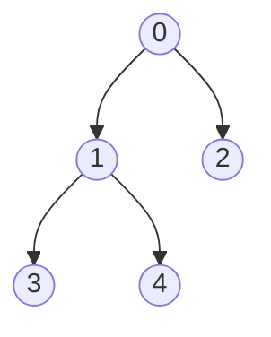

## `Programování` 1 pro matematiky

# 9. cvičení, 8-12-2022

###### tags: `Programovani 1 2022`, `čtvrtek`

-----

**Obsah**:

0. Farní oznamy
1. Opakování: n-tice, slovníky a množiny
2. Opakování: Funkce. Rekurze a generátory

### Farní oznamy

1. **Materiály k přednáškám** najdete v GitHub repozitáři https://github.com/PKvasnick/Programovani-1. Najdete tam také kód ke cvičením a pdf soubory textů cvičením.
2. **Domácí úkoly** 

   - Tento týden dostanete poslední set domácích úkolů v tomto semestru. 
   - Omlouvám se za zpoždění s kontrolou domácích úkolů a s řešeními.

**Kde se nacházíme** 

Dnes bude rychlé opakování a povíme si něco více o funkcích, příště začneme mluvit o třídách v Pythonu, čtení a zápisu do souborů a obsluze výjimek. 

------

## Opakování: n-tice, množiny, slovníky

### n-tice

**n-tice** je neměnná (immutable) struktura, která obsahuje několik objektů, které logicky patří k sobě, například souřadnice x, y bodu v rovině, den, měsíc a rok v datumu a pod. 

```python
>>> a = 1
>>> b = 2
>>> t = (a,b) # sbalení
>>> t
(1, 2)
>>> t[0], t[1]
(1, 2)
>>> t[0] = 3
Traceback (most recent call last):
  File "<pyshell#292>", line 1, in <module>
    t[0] = 3
TypeError: 'tuple' object does not support item assignment
>>> x, y = t # rozbalení
>>> x
1
>>> y
2
```

### Funkce `enumerate` a `zip`

Tyto dvě funkce náme umožňují iterovat přes indexy a položky nebo přes vícero kolekcí.

```python
>>> mesta = ["Praha", "Brno", "Ostrava"]
>>> list(enumerate(mesta):
[(0, 'Praha'), (1, 'Brno'), (2, 'Ostrava')]

>>> x = [-2.0, 0.0, 1.0]
>>> y = [0.0, -1.0, 1.0]
>>> list(zip(mesta, x, y))
[(Praha, -2.0, 0.0),(Brno, 0.0, -1.0), (Ostrava, 1.0, 1.0)]
```

## Množiny

Množiny jsou vysoce optimalizované kontejnery s rychlým vyhledáváním:

```python
>>> zvířata = {"kočka", "pes", "lev", "pes", "lev", "tygr"}
>>> zvířata
{'pes', 'tygr', 'lev', 'kočka'}
>>> "tygr" in zvířata # O(log n)
True 
>>> set(["a", "b", "c"])
{'b', 'c', 'a'}
set("abrakadabra")
{'d', 'b', 'a', 'r', 'k'}
>>> set() # prázdná množina
set()
>>> {} # není prázdná množina!
{}
>>> type({})
<class 'dict'>
```

Množiny využívají stromové struktury a algoritmy pro rychlé vyhledávání a modifikaci. Vytváření množin a operace:

```python
set("abrakadabra")
{'d', 'b', 'a', 'r', 'k'}
>>> a=set("abrakadabra")
>>> b=set("popokatepetl")
>>> "".join(sorted(a))
'abdkr'
>>> a & b # průnik
{'k', 'a'}
>>> a | b # sjednoceni
{'d', 'b', 'o', 'l', 'p', 'e', 'a', 'r', 't', 'k'}
>>> a - b # rozdíl
{'d', 'b', 'r'}
>>> a.remove("r")
>>> a
{'d', 'b', 'a', 'k'}
>>> b.add("b")
>>> b
{'o', 'b', 'l', 'p', 'e', 'a', 't', 'k'}
>>> a == b
False
```

## Slovníky

```python
>>> teploty = { "Praha": 17, "Dill´ı": 42,
"Longyearbyen": -46 }
>>> teploty
{'Praha': 17, 'Dill´ı': 42, 'Longyearbyen': -46}
>>> teploty["Praha"]
17
>>> teploty["Debrecen"]
Traceback (most recent call last):
  File "<pyshell#387>", line 1, in <module>
    teploty["Debrecen"]
KeyError: 'Debrecen'
>>> teploty["Debrecen"] = 28
>>> 
>>> del teploty["Debrecen"]
>>> "Debrecen" in teploty
False
>>> teploty["Miskolc"]
Traceback (most recent call last):
  File "<pyshell#394>", line 1, in <module>
    teploty["Miskolc"]
KeyError: 'Miskolc'
>>> teploty.get("Miskolc")
None
>>> teploty.get("Miskolc", 20)
20

# Iterujeme ve slovníku:
>>> for k in teploty.keys():
	print(k)

Praha
Dill´ı
Longyearbyen
>>> for v in teploty.values():
	print(v)

17
42
-46
>>> for k, v in teploty.items():
	print(k, v)

Praha 17
Dill´ı 42
Longyearbyen -46
>>> 
```

Comprehensions pro množiny a slovníky:

```python
>>> [i % 7 for i in range(50)]
[0, 1, 2, 3, 4, 5, 6, 0, 1, 2, 3, 4, 5, 6, 0, 1, 2, 3, 4, 5, 6, 0, 1, 2, 3, 4, 5, 6, 0, 1, 2, 3, 4, 5, 6, 0, 1, 2, 3, 4, 5, 6, 0, 1, 2, 3, 4, 5, 6, 0]
>>> {i % 7 for i in range(50)}
{0, 1, 2, 3, 4, 5, 6}
>>> {i : i % 7 for i in range(50)}
{0: 0, 1: 1, 2: 2, 3: 3, 4: 4, 5: 5, 6: 6, 7: 0, 8: 1, 9: 2, 10: 3, 11: 4, 12: 5, 13: 6, 14: 0, 15: 1, 16: 2, 17: 3, 18: 4, 19: 5, 20: 6, 21: 0, 22: 1, 23: 2, 24: 3, 25: 4, 26: 5, 27: 6, 28: 0, 29: 1, 30: 2, 31: 3, 32: 4, 33: 5, 34: 6, 35: 0, 36: 1, 37: 2, 38: 3, 39: 4, 40: 5, 41: 6, 42: 0, 43: 1, 44: 2, 45: 3, 46: 4, 47: 5, 48: 6, 49: 0}
>>> 
```

#### `defaultdict` - slovník s defaultní hodnotou *pro počítání*

```python
>>> from collections import defaultdict
>>> pocet = defaultdict(int)
>>> pocet[’abc’]
0
>>> from collections import defaultdict
>>> pocet = defaultdict(int)
>>> pocet["abc"]
0
# počítáme slova
>>> for w in "quick brown fox jumps over lazy dog".split():
	pocet[w] += 1
>>> pocet
defaultdict(<class 'int'>, {'abc': 0, 'quick': 1, 'brown': 1, 'fox': 1, 'jumps': 1, 'over': 1, 'lazy': 1, 'dog': 1})
>>> list(pocet.items())
[('abc', 0), ('quick', 1), ('brown', 1), ('fox', 1), ('jumps', 1), ('over', 1), ('lazy', 1), ('dog', 1)]

# počítáme délky slov
>>> podle_delek = defaultdict(list)
>>> for w in "quick brown fox jumps over lazy dog".split():
	podle_delek[len(w)].append(w)

>>> podle_delek
defaultdict(<class 'list'>, {5: ['quick', 'brown', 'jumps'], 3: ['fox', 'dog'], 4: ['over', 'lazy']})
>>> 
```

#### `collections.Counter`

```python
>>> from collections import Counter
>>> 
>>> myList = [1,1,2,3,4,5,3,2,3,4,2,1,2,3]
>>> print Counter(myList)
Counter({2: 4, 3: 4, 1: 3, 4: 2, 5: 1})
>>>
>>> print Counter(myList).items()
[(1, 3), (2, 4), (3, 4), (4, 2), (5, 1)]
>>> 
>>> print Counter(myList).keys()
[1, 2, 3, 4, 5]
>>> 
>>> print Counter(myList).values()
[3, 4, 4, 2, 1]
```

#### Slovníky jako základ složitějších struktur

Slovníky můžou obsahovat jako hodnoty další slovníky, a tak můžeme vytvářret rozsáhlé hierarchické struktury, např. stromy:

```python
strom = {"hodnota": 0, "deti" : [
    {"hodnota" : 1, "deti" : [
        {"hodnota": 3, "deti" : []},
        {"hodnota": 4, "deti" : []}
    ]},
    {"hodnota" : 2, "deti" : []}
	]}
```



Takovýto zápis není zvlášť praktický pro lidského čtenáře, ale důležité je, že dokážeme složité struktury zapsat do textové formy a pracovat s nimi. Tento přístup je základem datoveho formátu JSON (JavaScript Object Notation).

## Opakování: Funkce

### Příklady

Napište funkci, která

- vrátí řešení rovnice $2^x + x = 11$.

  Začneme tím, že zjevně $0 \lt x \lt 4$. a v tomto intervalu bude právě jedno řešení, protože funkce vlevo je rostoucí a vpravo konstantní. Programujeme, to, že řešení vidíte na první pohled, je dobré - máme kontrolu. 

  Snažíme se udělat obecnější řešení:

  ```python
  def fun(x):
      return 2**x + x - 11
  
  def eqn_solve(f, l, p, eps = 1.0e-6):
      """Požadujeme f(l) < 0 < f(p)"""
      if f(l) > 0 or f(p) < 0:
          print("l a p musí ohraničovat oblast, kde se nachází kořen. ")
          return None
      while abs(l-p) > eps:
          m = (l+p)/2
          if f(m)<0:
              l = m
          else:
              p = m
      return m
  
  def main():
      print(eqn_solve(fun, 0, 4))
  
  main()
  ```

### Lambda-funkce

Kapesní funkce jsou bezejmenné funkce, které můžeme definovat na místě potřeby. Šetří práci například u funkcí jako `sort`, `min/max`, `map` a `filter`.

```python
>>> seznam = [[0,10], [1,9], [2,8], [3,7], [4,6]]
>>> seznam.sort(key = lambda s: s[-1])
>>> seznam
[[4, 6], [3, 7], [2, 8], [1, 9], [0, 10]]
```

Zkuste použít lambda funkci i jako parametr funkce `eqn_solve`.

```python
print(eqn_solve(lambda x: 2**x + x - 20, 0, 4))
```

### Rekurze: Permutace

Chceme vygenerovat všechny permutace množiny (rozlišitelných) prvků. Nejjednodušší je použít rekurzivní metodu. 

```python
def getPermutations(array):
    if len(array) == 1:   # Base case
        return [array]
    permutations = []
    for i in range(len(array)): 
        # Aktuální prvek + všechny permutace pole bez něj
        perms = getPermutations(array[:i] + array[i+1:])  
        for p in perms:
            permutations.append([array[i], *p])
    return permutations

print(getPermutations([1,2,3]))
```

Výhoda je, že dostáváme permutace setříděné podle původního pořadí. 

Nevýhoda je, že dostáváme potenciálně obrovský seznam, který se nám musí vejít do paměti. Nešlo by to vyřešít tak, že bychom dopočítávali permutace po jedné podle potřeby? 

### Jiný příklad: Kombinace

Kombinace jsou něco jiné než permutace - permutace jsou pořadí, kombinace podmnožiny dané velikosti. 

Začneme se standardní verzí, vracející seznam všech kombinací velikosti n. Všimněte si prosím odlišnosti oproti permutacím:

```python
def combinations(a, n):
    result = []
    if n == 1:    # Base case: velikost 1 - vracíme seznam prvků
        for x in a:
            result.append([x])
        return result
    for i in range(len(a)):
        # Aktuální prvek + kombinace zbývajících o délce n-1
        for x in combinations(a[i+1:], n-1):
            result.append([a[i], *x])
    return result

print(combinations([1,2,3,4,5],2))

[[1, 2], [1, 3], [1, 4], [1, 5], [2, 3], [2, 4], [2, 5], [3, 4], [3, 5], [4, 5]]
```

---

### Generátory a příkaz yield

Dáme-li list comprehension do kulatých závorek místo hranatých, dostaneme namísto seznamu generátor. 

```python
>>> r = (x for x in range(20) if x % 3 == 2)
>>> r
<generator object <genexpr> at 0x000001BC701E9BD0>
>>> for j in r:
...     print(j)
...
2
5
8
11
14
17
```

Následující ukázka demonstruje, jak Python interaguje s iterátorem:

```python
>>> s = (x for x in range(3))
>>> next(s)
0
>>> next(s)
1
>>> next(s)
2
>>> next(s)
Traceback (most recent call last):
  File "<stdin>", line 1, in <module>
StopIteration
>>>
```

`next(it)` vrací další hodnotu iterátoru, a pokud už další hodnota není, vyvolá iterátor výjimku `StopIteration`.  To je standardní chování iterátoru.  Co se skrývá pod kapotou? Toto:

**Generátorem** nazýváme funkci, která může fungovat jako iterátor - lze ji opakovaně volat, a ona pokaždé vrátí následující hodnotu z nějaké posloupnosti.

**Příklad 1. **

```python
>>> def my_range(n):
    	k = 0
	    while k < n:
    	    yield k
        	k += 1
	    return

>>> list(my_range(5)

[0,1,2,3,4]
```

**Příklad 2**. Pokud vracíme hodnoty z posloupnosti, lze použít příkaz `yield from`:

```python
>>> def my_range2(n):
    	yield from range(n)

>>> list(my_range2(5)

[0,1,2,3,4]
```

**Příklad 3** vám bude povědomý:

```python
def read_list():
    while True:
        i = int(input())
        if i == -1:
            break
        yield i
    return 

for i in read_list():
    print(f"Načetlo se číslo {i}.")

print("Konec cyklu 1")

for j in read_list():
    print(f"Teď se načetlo číslo {i}")
    
print("Konec cyklu 2")
```

Takto můžeme lehce oddělit cyklus zpracování dat od cyklu jejich načítání.

**Generátory v Pythonu**

Funkce pro počítání permutací a kombinací nám dávají potenciálně obrovské seznamy. Nešlo by je implementovat jako generátory?

Šlo, a tak i jsou implementovány v modulu `itertools`:

*Combinatoric iterators:*

| Iterator                                                     | Arguments          | Results                                                      |
| ------------------------------------------------------------ | ------------------ | ------------------------------------------------------------ |
| [`product()`](https://docs.python.org/3/library/itertools.html#itertools.product) | p, q, … [repeat=1] | cartesian product, equivalent to a nested for-loop           |
| [`permutations()`](https://docs.python.org/3/library/itertools.html#itertools.permutations) | p[, r]             | r-length tuples, all possible orderings, no repeated elements |
| [`combinations()`](https://docs.python.org/3/library/itertools.html#itertools.combinations) | p, r               | r-length tuples, in sorted order, no repeated elements       |
| [`combinations_with_replacement()`](https://docs.python.org/3/library/itertools.html#itertools.combinations_with_replacement) | p, r               | r-length tuples, in sorted order, with repeated elements     |

| Examples                                   | Results                                           |
| ------------------------------------------ | ------------------------------------------------- |
| `product('ABCD', repeat=2)`                | `AA AB AC AD BA BB BC BD CA CB CC CD DA DB DC DD` |
| `permutations('ABCD', 2)`                  | `AB AC AD BA BC BD CA CB CD DA DB DC`             |
| `combinations('ABCD', 2)`                  | `AB AC AD BC BD CD`                               |
| `combinations_with_replacement('ABCD', 2)` | `AA AB AC AD BB BC BD CC CD DD`                   |


## 
