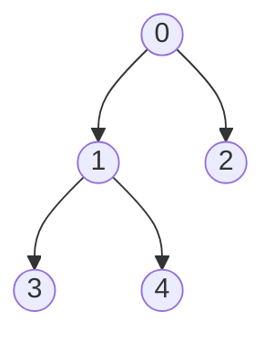

## `Programování` 1 pro matematiky

# 9. cvičení, 6-12-2022


**Obsah**:

0. Farní oznamy
1. Domácí úkoly
2. Cvičení: částečné setřídění seznamu na místě
3. Opakování: Funkce. Rekurze a generátory

### Farní oznamy

1. **Materiály k přednáškám** najdete v GitHub repozitáři https://github.com/PKvasnick/Programovani-1. Najdete tam také kód ke cvičením a pdf soubory textů cvičením.
2. **Domácí úkoly** 

   - Vyskytlo se několik typických problémů, u kterých se zastavím podrobněji.
   - Máme méně odevzdaných řešení, a úspěšnost byla v tomto kole poněkud nižší.

**Kde se nacházíme** 

Dnes bude rychlé opakování a povíme si něco více o funkcích, příště začneme mluvit o třídách v Pythonu, čtení a zápisu do souborů a obsluze výjimek. 

------

## Domácí úkoly

### Výběr vhodného kontejneru

**Inverze slovníku**

Toto bývá pociťováno jako těžší úloha, ale dopadla relativně dobře. ReCodEx u této úlohy často dává divné chyby nebo nedokáže rozeznat správné řešení, takže jsem několika z vás manuálně urpavil hodnocení.

Základní řešení: Vytvořit seznam dvojic (nositel, vlastnost) a přeorganizovat jej. 

**Benford, chybějící čísla**

Toto byla aplikace na seznam nebo slovník. Seznam postačuje, protože máte jednoduché rozsahy klíčů typu 1,2, … n. 

*_Vyhledávání v slovníku je rychlé, ale nic neporazí v rychlosti přímé indexování_*.

Pokud máte vytvořit přihrádky pro čísla 1..9 anebo 1..100, přidejte si nulový prvek. Seznam o jednu položku delší nikoho nezabije a používáte index totožné s hodnotou. U Benfordova testu navíc přihrádku pro 0 nutně potřebujete. 

---

### Různé

#### Vložka: Slovníky jako základ složitějších struktur

Slovníky můžou obsahovat jako hodnoty další slovníky, a tak můžeme vytvářret rozsáhlé hierarchické struktury, např. stromy:

```python
strom = {"hodnota": 0, "deti" : [
    {"hodnota" : 1, "deti" : [
        {"hodnota": 3, "deti" : []},
        {"hodnota": 4, "deti" : []}
    ]},
    {"hodnota" : 2, "deti" : []}
	]}
```



Takovýto zápis není zvlášť praktický pro lidského čtenáře, ale důležité je, že dokážeme složité struktury zapsat do textové formy a pracovat s nimi. Tento přístup je základem datoveho formátu JSON (JavaScript Object Notation).

#### Částečné setřídění pole

**Úloha**: Máme seznam celých čísel 0..n. Úloha je setřídit data *_na místě_* tak, aby byly všechny 0 na konci a zbylá data ve stejném pořadí na začátku seznamu. Tedy 

```python
[1,0,2,3,0,5,5,0,7] -> [1,2,3,5,5,7,0,0,0]
```

**Řešení**

*_Na místě_* znamená, že nebudeme vytvářet nový seznam a použijeme jenom fixní (nezávislou od velikosti vstupního seznamu) paměť pro potřebné proměnné.

Dva pointry: 

- levý ukazuje po řadě na nuly v seznamu
- pravý ukazuje na následující nenulovou hodnotu

Projíždíme pole, vyměňujeme nulu u levého pointru za nenulovou hodnotu u pravého pointru. Končíme, když se pravý pointr zarazí o konec pole. 

Neděláme nic fancy, žádné speciální kontejnery, žádný sort a pod., jenom jednoduchý přímočarý postup:

```python
from random import shuffle # pro generování dat


def zeros_back(data: list[int]) -> list[int]:
    left = 0
    right = 0
    n = len(data)
    while left < n:
        if data[left] > 0: # hledáme nulu
            left += 1
            continue
        right = left
        while right < n and data[right] == 0: # hledáme následující nenulovou hodnotu
            right += 1
        if right == n: # od left do konce seznamu jsou samé nuly, končíme.
            break
        data[left], data[right] = data[right], data[left] # Nalezli jsme, vyměníme
        left += 1
    return data


def read_data() -> list[int]:
    data = []
    while (n := int(input())) != -1:
        data.append(n)
    return data


def generate_data() -> list[int]:
    data = [i for i in range(1, 10)] + [0] * 10
    shuffle(data)
    return data


def main() -> None:
    data = generate_data()
    print(data)
    print(zeros_back(data))


if __name__ == '__main__':
    main()
```

---

## Pokračování: Funkce

### Lambda-funkce

Kapesní funkce jsou bezejmenné funkce, které můžeme definovat na místě potřeby. Šetří práci například u funkcí jako `sort`, `min/max`, `map` a `filter`.

```python
>>> seznam = [[0,10], [1,9], [2,8], [3,7], [4,6]]
>>> seznam.sort(key = lambda s: s[-1])
>>> seznam
[[4, 6], [3, 7], [2, 8], [1, 9], [0, 10]]
```

---

### Rekurze: Permutace

Chceme vygenerovat všechny permutace množiny (rozlišitelných) prvků. Nejjednodušší je použít rekurzivní metodu. 

```python
def getPermutations(array):
    if len(array) == 1:   # Base case
        return [array]
    permutations = []
    for i in range(len(array)): 
        # Aktuální prvek + všechny permutace pole bez něj
        perms = getPermutations(array[:i] + array[i+1:])  
        for p in perms:
            permutations.append([array[i], *p])
    return permutations

print(getPermutations([1,2,3]))
```

Výhoda je, že dostáváme permutace setříděné podle původního pořadí. 

Nevýhoda je, že dostáváme potenciálně obrovský seznam, který se nám musí vejít do paměti. Nešlo by to vyřešít tak, že bychom dopočítávali permutace po jedné podle potřeby? 

### Jiný příklad: Kombinace

Kombinace jsou něco jiné než permutace - permutace jsou pořadí, kombinace podmnožiny dané velikosti. 

Začneme se standardní verzí, vracející seznam všech kombinací velikosti n. Všimněte si prosím odlišnosti oproti permutacím:

```python
def combinations(a, n):
    result = []
    if n == 1:    # Base case: velikost 1 - vracíme seznam prvků
        for x in a:
            result.append([x])
        return result
    for i in range(len(a)):
        # Aktuální prvek + kombinace zbývajících o délce n-1
        for x in combinations(a[i+1:], n-1):
            result.append([a[i], *x])
    return result

print(combinations([1,2,3,4,5],2))

[[1, 2], [1, 3], [1, 4], [1, 5], [2, 3], [2, 4], [2, 5], [3, 4], [3, 5], [4, 5]]
```

---

### Generátory a příkaz yield

Dáme-li list comprehension do kulatých závorek místo hranatých, dostaneme namísto seznamu generátor. 

```python
>>> r = (x for x in range(20) if x % 3 == 2)
>>> r
<generator object <genexpr> at 0x000001BC701E9BD0>
>>> for j in r:
...     print(j)
...
2
5
8
11
14
17
```

Následující ukázka demonstruje, jak Python interaguje s iterátorem:

```python
>>> s = (x for x in range(3))
>>> next(s)
0
>>> next(s)
1
>>> next(s)
2
>>> next(s)
Traceback (most recent call last):
  File "<stdin>", line 1, in <module>
StopIteration
>>>
```

`next(it)` vrací další hodnotu iterátoru, a pokud už další hodnota není, vyvolá iterátor výjimku `StopIteration`.  To je standardní chování iterátoru.  Co se skrývá pod kapotou? Toto:

**Generátorem** nazýváme funkci, která může fungovat jako iterátor - lze ji opakovaně volat, a ona pokaždé vrátí následující hodnotu z nějaké posloupnosti.

**Příklad 1. **

```python
>>> def my_range(n):
    	k = 0
	    while k < n:
    	    yield k
        	k += 1
	    return

>>> list(my_range(5)

[0,1,2,3,4]
```

**Příklad 2**. Pokud vracíme hodnoty z posloupnosti, lze použít příkaz `yield from`:

```python
>>> def my_range2(n):
    	yield from range(n)

>>> list(my_range2(5)

[0,1,2,3,4]
```

**Příklad 3** vám bude povědomý:

```python
def read_list():
    while True:
        i = int(input())
        if i == -1:
            break
        yield i
    return 

for i in read_list():
    print(f"Načetlo se číslo {i}.")

print("Konec cyklu 1")

for j in read_list():
    print(f"Teď se načetlo číslo {i}")
    
print("Konec cyklu 2")
```

Takto můžeme lehce oddělit cyklus zpracování dat od cyklu jejich načítání.

**Generátory v Pythonu**

Funkce pro počítání permutací a kombinací nám dávají potenciálně obrovské seznamy. Nešlo by je implementovat jako generátory?

```python
def getPermutations(array):
    if len(array) == 1:   # Base case
        yield array
    for i in range(len(array)): 
        # Aktuální prvek + všechny permutace pole bez něj
        for p in getPermutations(array[:i] + array[i+1:]):
            yield [array[i], *p]

for p in getPermutations([1,2,3]):
    print(p)
```

Podobně pro kombinace:

```python
def combinations(a, n):
    if n == 1:    # Base case: velikost 1 - vracíme seznam prvků
        for x in a:
            yield [x]
    for i in range(len(a)):
        # Aktuální prvek + kombinace zbývajících o délce n-1
        for x in combinations(a[i+1:], n-1):
            yield [a[i], *x]

for c in combinations([1,2,3,4,5],2):
    print(c)
```

Tyto funkce jsou implementovány v modulu `itertools`:

*Combinatoric iterators:*

| Iterator                                                     | Arguments          | Results                                                      |
| ------------------------------------------------------------ | ------------------ | ------------------------------------------------------------ |
| [`product()`](https://docs.python.org/3/library/itertools.html#itertools.product) | p, q, … [repeat=1] | cartesian product, equivalent to a nested for-loop           |
| [`permutations()`](https://docs.python.org/3/library/itertools.html#itertools.permutations) | p[, r]             | r-length tuples, all possible orderings, no repeated elements |
| [`combinations()`](https://docs.python.org/3/library/itertools.html#itertools.combinations) | p, r               | r-length tuples, in sorted order, no repeated elements       |
| [`combinations_with_replacement()`](https://docs.python.org/3/library/itertools.html#itertools.combinations_with_replacement) | p, r               | r-length tuples, in sorted order, with repeated elements     |

| Examples                                   | Results                                           |
| ------------------------------------------ | ------------------------------------------------- |
| `product('ABCD', repeat=2)`                | `AA AB AC AD BA BB BC BD CA CB CC CD DA DB DC DD` |
| `permutations('ABCD', 2)`                  | `AB AC AD BA BC BD CA CB CD DA DB DC`             |
| `combinations('ABCD', 2)`                  | `AB AC AD BC BD CD`                               |
| `combinations_with_replacement('ABCD', 2)` | `AA AB AC AD BB BC BD CC CD DD`                   |

---

### Příklad: Erastothenovo síto

Jednoduchý generátor, generující čísla n, n+1, … můžeme implementovat například takto:

```python
def nums(n):
    yield n
    yield from nums(n+1)
```

Není to moc dobrá implementace, protože je rekurzivní,  ale má základní vlastnosti, které potřebujeme:

- generuje potenciálně nekonečnou řadu čísel
- pamatuje si svůj vnitřní stav a na vyžádání nabídne další číslo.

Erastothenovo síto implementujeme tak, jak velí základní algoritmus: Začínáme s přirozenými čísly 2, 3, …, a proséváme je tak, že najdeme další číslo, které je prvočíslem, a pak odstraníme z posloupnosti všechny jeho násobky:

```python
def nums(n):
    yield n
    yield from nums(n+1)


def sieve(s):
    n = next(s)
    yield n
    yield from sieve(i for i in s if i % n != 0)


s = sieve(nums(2))
for i in s:
    if i < 100:
    	print(i)
	else: break

```

Toto není zajímavé pro reálné aplikace, kde nás zajímají obrovská prvočísla, protože to je hluboce rekurzivní implementace; ale je to dobrá ukázka toho, co lze udělat s generátory. 
